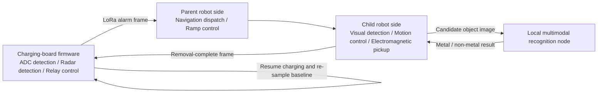

# EV Wireless Charging Safety Guardian

This project implements a safety monitoring and automated foreign-object removal system for electric-vehicle wireless charging scenarios. It combines metal foreign-object detection on the charging-board firmware, biological-object proximity detection, LoRa alarm communication, parent-robot navigation and dispatch, child-robot visual recognition and object removal, and local multimodal model reasoning to form a closed loop from risk detection to object removal and charging recovery.

## Table of Contents

- [Project Overview](#project-overview)
- [System Architecture](#system-architecture)
- [Code Structure](#code-structure)
- [Core Implementation](#core-implementation)
- [Communication Protocols and ROS2 Topics](#communication-protocols-and-ros2-topics)
- [Runtime Environment](#runtime-environment)
- [Build and Launch](#build-and-launch)
- [Model and Resource Files](#model-and-resource-files)

## Project Overview

During wireless charging, the transmitter coil and receiver coil form an open high-frequency alternating electromagnetic field. Conductive objects such as coins, metal fragments, and pull tabs may enter the coupling area and cause eddy-current heating, reduced charging efficiency, device overload, or fire hazards. Biological objects approaching the charging area also require timely safety protection.

This project provides an automated safety system with the following capabilities:

- The charging-board firmware continuously samples detection-coil voltage changes and identifies metal foreign objects through multi-channel ADC sampling and trimmed-mean filtering.
- Millimeter-wave radar serial data is used to detect possible biological-object proximity risks and stop charging through relay control.
- The LoRa module sends an alarm frame to the robot side after a metal foreign object is detected.
- The parent robot performs wide-area navigation, reaches the target parking space, releases the child robot, and runs a local multimodal model for secondary metal/non-metal classification.
- The child robot enters the constrained space under the vehicle, crops candidate foreign-object images using YOLOv11 object detection, and removes metal objects with an electromagnet.
- After removal is completed, the robot side sends a completion frame back to the charging board. The charging board restores power and re-samples the baseline voltage.

## System Architecture



The charging board is the safety entry point, while the robot system executes the removal loop. The charging board first performs hardware-level power cutoff protection. The robot system then locates, recognizes, and removes the foreign object, after which the charging board resumes the charging state.

## Code Structure

```text
ProjectCode/
├── ChargingBoard/
│   ├── USER/                 # STM32 main program and Keil project
│   ├── HARDWARE/             # ADC, radar, LoRa, relay, OLED, and other drivers
│   ├── SYSTEM/               # Delay, serial, and system support modules
│   ├── CORE/                 # Cortex-M startup and core headers
│   └── FWLIB/                # STM32 standard peripheral library
├── ParentRobot/
│   ├── Chassis/              # ROS2 chassis serial, odometry, IMU, and sensor interfaces
│   ├── Navigation/           # SLAM, Nav2, map saving, and navigation parameters
│   ├── LoRaCommunication/    # LoRa serial communication script
│   ├── MetalRecognition/     # Local multimodal metal-recognition ROS2 node
│   └── RampControl/          # Ramp motor extend/retract scripts
└── ChildRobot/
    ├── yolov11_640x640_nv12.bin
    ├── resnet18_224x224_nv12.bin
    └── Identify_LLM/
        ├── Identify_LLM/
        │   ├── identify.py       # Object detection and candidate image publishing
        │   ├── clean.py          # Foreign-object removal state machine and electromagnet control
        │   ├── motion.py         # Timed velocity control
        │   └── pid_controller.py # PID controller
        ├── launch/
        ├── config/
        └── setup.py
```

## Core Implementation

### 1. Charging-Board Firmware

The charging-board firmware runs on the STM32F407 platform. The entry point is `ChargingBoard/USER/main.c`, and peripheral initialization is handled by `HARDWARE/system_init.c`.

Main workflow:

1. Initialize delay, OLED, relay, LED, ADC DMA, radar serial, and LoRa serial modules.
2. Send radar start and baud-rate configuration commands to prepare radar data acquisition.
3. Call `ADC_getstdvalue()` to collect the baseline ADC voltage under the no-foreign-object state.
4. Perform metal foreign-object detection only while the board is in the normal charging state.
5. If the ADC difference exceeds the threshold, set the metal-object flag, send a LoRa alarm frame, and disconnect the relay.
6. If the radar interrupt state machine detects a proximity risk, disconnect the relay and enter the protection state.
7. After receiving the removal-complete frame, resume charging, re-sample the ADC baseline, and clear abnormal flags.

Key files:

| File | Purpose |
| --- | --- |
| `HARDWARE/ADC.c` | 8-channel ADC DMA continuous sampling, 200-point sorting and extreme-value trimming, mV conversion, and baseline comparison |
| `HARDWARE/Radar.c`, `HARDWARE/Serial.c` | Radar command-frame transmit/receive, 13-byte packet parsing, and distance/speed threshold alarms |
| `HARDWARE/lora.c`, `HARDWARE/usart1.c` | LoRa alarm-frame transmission and removal-complete frame reception state machine |
| `HARDWARE/Relay.c` | Relay power-on/power-off control; low level conducts and high level disconnects |
| `HARDWARE/OLED.c` | Displays metal-object, biological-object, charging-status, and ADC difference information |

For ADC detection, `ADC_SAMPLE_PNUM` is 200, `ADC_SAMPLE_CNUM` is 8, and `value_wave` is 50 mV. `ADC_average()` sorts the samples from a single channel and removes 30 extreme values from each end, reducing the impact of transient noise and abnormal spikes.

### 2. Parent Robot Side

The parent robot side handles field navigation, communication reception, local model inference, and child robot release.

#### Chassis and Navigation

`ParentRobot/Chassis` is a ROS2 C++ chassis-control package. Its core node connects to the lower-level controller through serial communication, subscribes to velocity commands, and publishes odometry, IMU, voltage, charging status, and ultrasonic distance data.

Main capabilities:

- Subscribe to `cmd_vel` and package linear/angular velocities into lower-level control frames.
- Read chassis velocity, IMU, voltage, and other sensor data from the serial port.
- Integrate velocity and publish the `odom` odometry topic.
- Publish `imu/data_raw` and generate `imu/data_filtered` through the IMU processing node.
- Provide EKF configuration to fuse odometry and IMU into a more stable pose estimate.

`ParentRobot/Navigation` provides SLAM, map saving, and Nav2 launch files. It includes AMCL, local/global costmaps, planner, controller, and recovery behavior configurations. The navigation stack is organized for a differential chassis and uses laser scan data for mapping and obstacle avoidance.

#### LoRa Communication

`ParentRobot/LoRaCommunication/lora_uart.py` encapsulates LoRa serial communication:

- Automatically detects available UART ports.
- Opens the serial port at 115200 baud.
- Supports AT command transmission, hexadecimal frame transmission, and data reception.
- Can be used by the robot side to receive charging-board alarms or send removal-complete frames back to the charging board.

#### Local Multimodal Recognition

`ParentRobot/MetalRecognition/metal_detector.py` is a ROS2 node that performs secondary judgment on candidate foreign-object images sent by the child robot.

Processing workflow:

1. Subscribe to `/send_target` and receive cropped images published by the child robot.
2. Push images into a FIFO queue to prevent consecutive multi-target uploads from overwriting each other.
3. Publish the image to `/image`, then publish the prompt to `/prompt_text` after a 0.5 s delay.
4. Subscribe to `/llama_cpp_node` to obtain model output.
5. Parse the final conclusion from the model text and publish `UInt8=1` for metal targets and `UInt8=0` for non-metal targets.
6. If inference exceeds the default timeout of 15 s, publish `0` automatically to prevent the child robot state machine from blocking indefinitely.

#### Ramp Control

`ParentRobot/RampControl` contains two scripts for ramp extension and retraction. They control a DRV8833 motor driver through GPIO:

- `AIN1=HIGH, AIN2=LOW`: lower the ramp to create a path for the child robot to exit.
- `AIN1=LOW, AIN2=HIGH`: retract the ramp.
- `STBY` is pulled high by software by default. When the script exits, the motor is stopped and GPIO resources are released.

### 3. Child Robot Side

The child robot ROS2 Python package is located under `ChildRobot/Identify_LLM`. It handles candidate-object detection, coordinate publishing, foreign-object removal actions, and electromagnet control.

#### Object Detection Node

`Identify_LLM/identify.py` defines `IdentifyNode`, which performs object detection and candidate image publishing:

- Loads `yolov11_640x640_nv12.bin` using `hobot_dnn`.
- Converts camera BGR images to the NV12 input format.
- Parses model output as `(5, 8400)`, then applies confidence filtering and NMS to obtain candidate boxes.
- Sorts candidate boxes by area in descending order, draws each candidate, and saves target frames.
- Publishes candidate images to `send_target` and normalized target-center coordinates to `identify_target`.
- Uses `reach_goal_LLM` to trigger the recognition task and `identify_continue` to receive the continue-processing signal.

Internal node states:

| State | Meaning |
| --- | --- |
| `IDLE` | Waiting for trigger |
| `MOVING` | Moving forward to the detection position at a fixed speed |
| `WAITING` | Short pause after movement to stabilize the image |
| `DETECTING` | Running YOLO inference and publishing candidate images |
| `WAITING_RESULT` | Waiting for the parent robot's model result |
| `HELPING_CLEANUP` | Continuously outputting target position to assist the removal node |
| `DONE` | Releasing camera/model resources and returning to idle |

#### Foreign-Object Removal Node

`Identify_LLM/clean.py` defines `CleanNode`, which controls the child robot to perform foreign-object removal based on the model result:

- Subscribes to `send_target_result`; `1` means removal is required and `0` means the current candidate should be skipped.
- Subscribes to `identify_target` and uses the normalized target center for angular alignment.
- Subscribes to `odom_combined`, records the current yaw, and estimates rotation angle.
- Publishes `cmd_vel` for chassis motion and `magnet_control` for electromagnet status.
- Controls the physical electromagnet through GPIO.

The removal state machine includes target searching, PID alignment, forward pickup, backward motion, rotation reset, red guide-line searching, line-center alignment, object delivery, and task completion. Red-line detection uses HSV dual-range thresholding, morphological processing, and vertical projection. The midpoint of the left and right red lines is used as the alignment error.

#### Control Helpers

- `motion.py` provides timed forward-motion control without blocking the ROS2 main loop.
- `pid_controller.py` provides a PID controller with integral limiting for target alignment and line-center alignment.
- `launch/identify_llm.launch.py` launches the chassis base, recognition node, and foreign-object removal node, and remaps the velocity topic to the actual chassis velocity interface.

## Communication Protocols and ROS2 Topics

### LoRa Frame Protocol

| Direction | Frame | Meaning |
| --- | --- | --- |
| Charging board -> robot | `FF AA 10 10 EE` | Metal foreign object detected; stop charging and request object removal |
| Robot -> charging board | `FF AA 01 01 EE` | Foreign-object removal completed; charging can be resumed |

The charging board uses a USART1 interrupt state machine to parse the completion frame. After a valid header, payload, and tail are received, it sets the completion flag. The main loop then restores relay conduction and re-samples the ADC baseline.

### ROS2 Topics

| Module | Topic | Type | Direction | Description |
| --- | --- | --- | --- | --- |
| Child robot recognition node | `reach_goal_LLM` | `std_msgs/UInt8` | Subscribe | Triggers child robot detection after the parent robot reaches the target |
| Child robot recognition node | `send_target` | `sensor_msgs/Image` | Publish | Candidate foreign-object image |
| Child robot recognition node | `identify_target` | `geometry_msgs/Point` | Publish | Normalized target center and area |
| Child robot recognition node | `identify_continue` | `std_msgs/UInt8` | Subscribe | Continues to the next target after model judgment or removal completion |
| Child robot recognition node | `line_camera_image` | `sensor_msgs/CompressedImage` | Publish | Assists red-line detection during object removal |
| Child robot removal node | `send_target_result` | `std_msgs/UInt8` | Subscribe | Model result; 1 means remove, 0 means skip |
| Child robot removal node | `cmd_vel` | `geometry_msgs/Twist` | Publish | Chassis velocity control |
| Child robot removal node | `magnet_control` | `std_msgs/Bool` | Publish | Logical electromagnet state |
| Child robot removal node | `helping_cleanup_start` | `std_msgs/UInt8` | Publish | Requests the recognition node to continuously output target position |
| Parent robot recognition node | `/send_target` | `sensor_msgs/Image` | Subscribe | Receives candidate foreign-object images |
| Parent robot recognition node | `/image` | `sensor_msgs/Image` | Publish | Forwards images to the multimodal model service |
| Parent robot recognition node | `/prompt_text` | `std_msgs/String` | Publish | Sends recognition prompt |
| Parent robot recognition node | `/llama_cpp_node` | `ai_msgs/PerceptionTargets` | Subscribe | Receives model output |
| Parent robot recognition node | `/send_target_result` | `std_msgs/UInt8` | Publish | Returns metal/non-metal result |
| Chassis control node | `odom` | `nav_msgs/Odometry` | Publish | Chassis odometry |
| Chassis control node | `imu/data_raw` | `sensor_msgs/Imu` | Publish | Raw IMU data |
| IMU processing node | `imu/data_filtered` | `sensor_msgs/Imu` | Publish | Attitude-filtered IMU data |

## Runtime Environment

### Charging-Board Firmware

- MCU: STM32F407 series
- Development tool: Keil MDK
- Firmware library: STM32F4 standard peripheral library
- Peripherals: ADC DMA, USART1, USART3, GPIO, OLED, relay, LoRa, millimeter-wave radar

### Parent and Child Robot ROS2 Side

- ROS2 Humble
- Python 3
- C++14 build environment
- OpenCV, NumPy, cv_bridge, pyserial
- `rclpy`, `rclcpp`, `std_msgs`, `sensor_msgs`, `geometry_msgs`, `nav_msgs`
- `nav2_bringup`, `slam_toolbox`, `robot_localization`
- `hobot_dnn` and local multimodal model inference service
- GPIO library: `Hobot.GPIO` or `RPi.GPIO`

## Build and Launch

> The following commands use neutral package-name placeholders. If package names, launch files, or workspace paths are anonymized before open-source release, update `CMakeLists.txt`, `setup.py`, launch files, and parameter files accordingly.

### 1. Build the Charging-Board Firmware

1. Open `ChargingBoard/USER/Template.uvprojx` in Keil MDK.
2. Check the target chip, downloader, and serial configuration.
3. Build the project and flash it to the STM32F407 controller.
4. After power-on, the OLED displays charging status, detection flags, and ADC channel differences.

### 2. Build the ROS2 Workspace

```bash
source /opt/ros/humble/setup.bash
cd <ros2_ws>
colcon build
source install/setup.bash
```

### 3. Launch Parent Robot Navigation

```bash
source /opt/ros/humble/setup.bash
source <ros2_ws>/install/setup.bash
ros2 launch <navigation_package> <navigation_launch_file> map:=<map_file.yaml>
```

Use the SLAM launch file during mapping. When a map is available, use the Nav2 localization and navigation launch files. The map-saving script is based on `map_saver_cli` from `nav2_map_server`.

### 4. Launch Local Multimodal Recognition

Start the local model service first, then start the recognition node:

```bash
source /opt/ros/humble/setup.bash
ros2 run <local_model_service_package> <model_service_node> --ros-args -p feed_type:=1
python3 ParentRobot/MetalRecognition/metal_detector.py
```

The model service should subscribe to `/image` and `/prompt_text`, then return inference results through `/llama_cpp_node`.

### 5. Launch Child Robot Recognition and Object Removal

```bash
source /opt/ros/humble/setup.bash
source <ros2_ws>/install/setup.bash
ros2 launch Identify_LLM identify_llm.launch.py
```

For debugging, trigger one task manually:

```bash
ros2 topic pub --once /reach_goal_LLM std_msgs/msg/UInt8 "{data: 1}"
```

To simulate a metal-object result from the model:

```bash
ros2 topic pub --once /send_target_result std_msgs/msg/UInt8 "{data: 1}"
```

## Model and Resource Files

| File | Description |
| --- | --- |
| `ChildRobot/yolov11_640x640_nv12.bin` | Child robot BPU object-detection model; input format is 640x640 NV12 |
| `ChildRobot/resnet18_224x224_nv12.bin` | Backup image model resource |
| `ChildRobot/Identify_LLM/output/` | Debug output directory for saved candidate target frames |

`identify.py` uses a board-side absolute path for the model by default. During deployment, update `model_bin` according to the actual workspace path, or pass the model path through ROS2 parameters.
