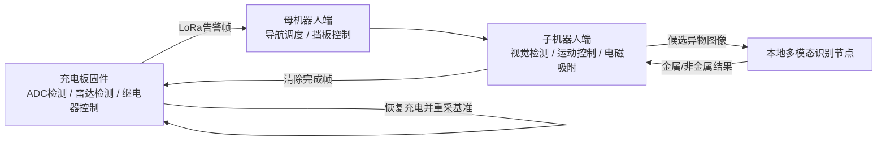

# 安充卫士 - 电动汽车无线充电安全保障系统

面向电动汽车无线充电场景的安全监测与自动化异物清除项目。系统通过充电板端的金属异物检测、生物体靠近检测、LoRa 告警通信、母机器人导航调度、子机器人视觉识别与异物清除，以及本地多模态模型判别，形成从风险发现到异物清除再到恢复充电的闭环。


## 目录

- [项目简介](#项目简介)
- [系统架构](#系统架构)
- [代码结构](#代码结构)
- [核心实现](#核心实现)
- [通信协议与话题接口](#通信协议与话题接口)
- [运行环境](#运行环境)
- [构建与启动](#构建与启动)
- [模型与资源文件](#模型与资源文件)

## 项目简介

无线充电过程中，发射线圈与接收线圈之间存在开放式高频交变磁场。硬币、金属碎片、易拉罐拉环等导电异物进入耦合区域后，可能产生涡流发热、充电效率下降、设备过载和火灾隐患；生物体靠近充电区域时，也需要及时触发安全保护。

本项目实现了一套自动化安全保障系统：

- 充电板固件实时采集检测线圈电压变化，通过 ADC 多通道采样和截尾均值滤波判断金属异物。
- 毫米波雷达串口数据用于判断疑似生物体靠近风险，并联动继电器停止充电。
- LoRa 模块在检测到金属异物后向机器人侧发送告警帧。
- 母机器人负责大范围导航、到达目标车位、释放子机器人，并承载本地多模态模型完成金属/非金属二次判别。
- 子机器人进入车辆底部受限空间，通过 YOLOv11 目标检测裁切候选异物图像，并基于电磁铁完成吸附清除。
- 清除完成后回传完成帧，充电板恢复供电并重新采集基准电压。

## 系统架构



整体链路以充电板为安全入口，以机器人端为执行闭环。充电板先执行硬件级断电保护，再由机器人系统完成异物定位、识别和清除，最后恢复充电状态。

## 代码结构

```text
项目代码/
├── 充电板/
│   ├── USER/                 # STM32 主程序与 Keil 工程
│   ├── HARDWARE/             # ADC、雷达、LoRa、继电器、OLED 等驱动
│   ├── SYSTEM/               # 延时、串口、系统基础支持
│   ├── CORE/                 # Cortex-M 启动与内核头文件
│   └── FWLIB/                # STM32 标准外设库
├── 母机器人端/
│   ├── 底盘相关代码/          # ROS2 底盘串口、里程计、IMU 与传感器接口
│   ├── 导航相关代码/          # SLAM、Nav2、地图保存与导航参数
│   ├── lora通信/             # LoRa 串口收发脚本
│   ├── 大模型金属识别/        # 本地多模态模型识别 ROS2 节点
│   └── 挡板控制/             # 挡板电机伸出/收回控制脚本
└── 子机器人端/
    ├── yolov11_640x640_nv12.bin
    ├── resnet18_224x224_nv12.bin
    └── Identify_LLM/
        ├── Identify_LLM/
        │   ├── identify.py       # 目标检测与候选图发布
        │   ├── clean.py          # 异物清除状态机与电磁铁控制
        │   ├── motion.py         # 定时速度控制
        │   └── pid_controller.py # PID 控制器
        ├── launch/
        ├── config/
        └── setup.py
```

## 核心实现

### 1. 充电板固件

充电板固件运行在 STM32F407 平台，入口位于 `充电板/USER/main.c`，外设初始化由 `HARDWARE/system_init.c` 统一完成。

主要逻辑如下：

1. 初始化延时、OLED、继电器、LED、ADC DMA、雷达串口和 LoRa 串口。
2. 发送雷达启动和波特率配置命令，完成雷达数据读取准备。
3. 调用 `ADC_getstdvalue()` 采集无异物状态下的 ADC 基准电压。
4. 主循环中仅在正常充电状态下执行金属异物检测。
5. 若 ADC 差值超过阈值，置位金属异物标志，发送 LoRa 告警帧并断开继电器。
6. 若雷达中断状态机判断存在靠近风险，同样断开继电器并进入保护状态。
7. 收到清除完成帧后恢复充电，重新采集 ADC 基准值，清空异常标志。

关键文件：

| 文件 | 作用 |
| --- | --- |
| `HARDWARE/ADC.c` | 8 通道 ADC DMA 连续采样，200 点排序去极值后求均值，换算为 mV 并与基准值比较 |
| `HARDWARE/Radar.c`、`HARDWARE/Serial.c` | 雷达命令帧收发、13 字节数据包解析、距离/速度阈值报警 |
| `HARDWARE/lora.c`、`HARDWARE/usart1.c` | LoRa 告警帧发送与清除完成帧接收状态机 |
| `HARDWARE/Relay.c` | 继电器上电/断电控制，低电平导通，高电平断开 |
| `HARDWARE/OLED.c` | 显示金属异物、生物体和充电状态，以及 ADC 差值信息 |

ADC 检测中，`ADC_SAMPLE_PNUM` 为 200，`ADC_SAMPLE_CNUM` 为 8，`value_wave` 为 50 mV。`ADC_average()` 对单通道采样值排序后去掉两端 30 个极值，有助于降低瞬态噪声和异常尖峰对判断的影响。

### 2. 母机器人端

母机器人端承担场地导航、通信接收、本地模型推理和子机器人释放。

#### 底盘与导航

`母机器人端/底盘相关代码` 是 ROS2 C++ 底盘控制工程，核心节点通过串口连接下位机，订阅速度指令并发布里程计、IMU、电压、充电状态和超声波距离等数据。主要能力包括：

- 订阅 `cmd_vel`，将线速度和角速度封装为下位机控制帧。
- 从串口读取底盘速度、IMU、电压等传感数据。
- 对速度进行积分，发布 `odom` 里程计话题。
- 发布 `imu/data_raw`，并通过 IMU 处理节点输出 `imu/data_filtered`。
- 提供 EKF 配置，将里程计和 IMU 融合为更稳定的位姿估计。

`母机器人端/导航相关代码` 提供 SLAM、地图保存和 Nav2 导航启动文件，包含 AMCL、局部/全局代价地图、路径规划器、控制器和恢复行为等配置。系统默认按差速底盘参数组织导航链路，并使用激光雷达 `scan` 数据完成建图与避障。

#### LoRa 通信

`母机器人端/lora通信/lora_uart.py` 封装了 LoRa 串口通信工具：

- 自动探测可用 UART 端口。
- 以 115200 波特率打开串口。
- 支持 AT 指令发送、十六进制帧发送和数据接收。
- 可用于机器人端接收充电板告警，或向充电板回传清除完成信号。

#### 本地多模态识别

`母机器人端/大模型金属识别/metal_detector.py` 是 ROS2 节点，负责对子机器人传回的候选异物图像做二次判断。

处理流程：

1. 订阅 `/send_target`，接收子机器人发布的裁切图像。
2. 将图片放入 FIFO 队列，避免多目标连续上传时互相覆盖。
3. 发布图像到 `/image`，延迟 0.5 s 后发布提示词到 `/prompt_text`。
4. 订阅 `/llama_cpp_node` 获取模型输出。
5. 从模型文本中解析最终结论，将金属目标发布为 `UInt8=1`，非金属目标发布为 `UInt8=0`。
6. 若推理超过默认 15 s，自动发布 `0`，保证子机器人状态机不会永久阻塞。

#### 挡板控制

`母机器人端/挡板控制` 中包含伸出和收回两个脚本，通过 GPIO 控制 DRV8833 电机驱动芯片：

- `AIN1=HIGH, AIN2=LOW`：挡板放下，形成子机器人驶出斜坡。
- `AIN1=LOW, AIN2=HIGH`：挡板收回。
- `STBY` 默认由软件拉高使能，脚本退出时会停止电机并释放 GPIO。

### 3. 子机器人端

子机器人 ROS2 Python 包位于 `子机器人端/Identify_LLM`。它完成候选异物检测、坐标发布、异物清除动作和电磁铁控制。

#### 目标检测节点

`Identify_LLM/identify.py` 中的 `IdentifyNode` 负责目标检测和候选图发布：

- 使用 `hobot_dnn` 加载 `yolov11_640x640_nv12.bin`。
- 将摄像头 BGR 图像转换为 NV12 输入格式。
- 模型输出按 `(5, 8400)` 解析，经过置信度过滤与 NMS 得到候选框。
- 候选框按面积从大到小排序，逐个绘制并保存为目标帧。
- 发布候选图像到 `send_target`，发布归一化目标中心点到 `identify_target`。
- 通过 `reach_goal_LLM` 触发识别任务，通过 `identify_continue` 接收继续处理信号。

节点内部状态包括：

| 状态 | 含义 |
| --- | --- |
| `IDLE` | 等待触发 |
| `MOVING` | 按固定速度前进到检测位置 |
| `WAITING` | 运动后短暂停顿，等待画面稳定 |
| `DETECTING` | 执行 YOLO 推理并发布候选图 |
| `WAITING_RESULT` | 等待母机器人端大模型返回金属/非金属结果 |
| `HELPING_CLEANUP` | 持续输出目标位置，辅助异物清除节点闭环控制 |
| `DONE` | 释放摄像头和模型资源，回到空闲 |

#### 异物清除节点

`Identify_LLM/clean.py` 中的 `CleanNode` 根据大模型结果控制子机器人执行异物清除：

- 订阅 `send_target_result`，`1` 表示需要清理，`0` 表示跳过当前候选目标。
- 订阅 `identify_target`，用目标归一化中心点进行角度对准。
- 订阅 `odom_combined`，记录当前 yaw 并估计旋转角度。
- 发布 `cmd_vel` 控制底盘运动，发布 `magnet_control` 表示电磁铁状态。
- 通过 GPIO 控制电磁铁实际通断。

异物清除状态机包含搜索目标、PID 对准、吸附前进、倒退、旋转回正、寻找红色引导线、线中点对准、送出异物和任务完成等阶段。红线检测使用 HSV 双区间阈值、形态学处理和垂直投影，取左右两条红线的中点作为对准误差。

#### 控制辅助

- `motion.py` 提供定时直行控制，避免阻塞 ROS2 主循环。
- `pid_controller.py` 提供带积分限幅的 PID 控制器，用于目标对准和线中点对准。
- `launch/identify_llm.launch.py` 同时启动底盘基础能力、识别节点和异物清除节点，并将速度话题重映射到实际底盘速度接口。

## 通信协议与话题接口

### LoRa 帧协议

| 方向 | 帧内容 | 含义 |
| --- | --- | --- |
| 充电板 -> 机器人 | `FF AA 10 10 EE` | 检测到金属异物，停止充电并请求异物清除 |
| 机器人 -> 充电板 | `FF AA 01 01 EE` | 异物清除完成，允许恢复充电 |

充电板端使用 USART1 中断状态机解析完成帧，收到合法包头、数据位和包尾后置位完成标志。主循环检测到该标志后恢复继电器导通，并重新采集 ADC 基准。

### ROS2 话题

| 模块 | 话题 | 类型 | 方向 | 说明 |
| --- | --- | --- | --- | --- |
| 子机器人识别节点 | `reach_goal_LLM` | `std_msgs/UInt8` | 订阅 | 母机器人到位后触发子机器人检测 |
| 子机器人识别节点 | `send_target` | `sensor_msgs/Image` | 发布 | 候选异物图像 |
| 子机器人识别节点 | `identify_target` | `geometry_msgs/Point` | 发布 | 归一化目标中心点与面积 |
| 子机器人识别节点 | `identify_continue` | `std_msgs/UInt8` | 订阅 | 大模型或异物清除完成后继续处理下一目标 |
| 子机器人识别节点 | `line_camera_image` | `sensor_msgs/CompressedImage` | 发布 | 异物清除期间辅助红线检测 |
| 子机器人异物清除节点 | `send_target_result` | `std_msgs/UInt8` | 订阅 | 大模型判别结果，1 为执行清除，0 为跳过 |
| 子机器人异物清除节点 | `cmd_vel` | `geometry_msgs/Twist` | 发布 | 底盘速度控制 |
| 子机器人异物清除节点 | `magnet_control` | `std_msgs/Bool` | 发布 | 电磁铁逻辑状态 |
| 子机器人异物清除节点 | `helping_cleanup_start` | `std_msgs/UInt8` | 发布 | 请求识别节点持续输出目标位置 |
| 母机器人识别节点 | `/send_target` | `sensor_msgs/Image` | 订阅 | 接收候选异物图像 |
| 母机器人识别节点 | `/image` | `sensor_msgs/Image` | 发布 | 转发给多模态模型服务 |
| 母机器人识别节点 | `/prompt_text` | `std_msgs/String` | 发布 | 发送识别提示词 |
| 母机器人识别节点 | `/llama_cpp_node` | `ai_msgs/PerceptionTargets` | 订阅 | 接收模型输出 |
| 母机器人识别节点 | `/send_target_result` | `std_msgs/UInt8` | 发布 | 返回金属/非金属结果 |
| 底盘控制节点 | `odom` | `nav_msgs/Odometry` | 发布 | 底盘里程计 |
| 底盘控制节点 | `imu/data_raw` | `sensor_msgs/Imu` | 发布 | 原始 IMU 数据 |
| IMU 处理节点 | `imu/data_filtered` | `sensor_msgs/Imu` | 发布 | 姿态滤波后的 IMU 数据 |

## 运行环境

### 充电板固件

- MCU：STM32F407 系列
- 开发工具：Keil MDK
- 固件库：STM32F4 标准外设库
- 外设：ADC DMA、USART1、USART3、GPIO、OLED、继电器、LoRa、毫米波雷达

### 母机器人与子机器人 ROS2 端

- ROS2 Humble
- Python 3
- C++14 编译环境
- OpenCV、NumPy、cv_bridge、pyserial
- `rclpy`、`rclcpp`、`std_msgs`、`sensor_msgs`、`geometry_msgs`、`nav_msgs`
- `nav2_bringup`、`slam_toolbox`、`robot_localization`
- `hobot_dnn` 与本地多模态模型推理服务
- GPIO 库：`Hobot.GPIO` 或 `RPi.GPIO`

## 构建与启动

> 下列命令使用中性包名占位。若开源前对包名、launch 文件或工作空间路径做了匿名化重命名，请同步更新 `CMakeLists.txt`、`setup.py`、launch 文件和参数文件中的引用。

### 1. 编译充电板固件

1. 使用 Keil MDK 打开 `充电板/USER/Template.uvprojx`。
2. 检查目标芯片、下载器和串口配置。
3. 编译工程并烧录到 STM32F407 控制板。
4. 上电后 OLED 会显示充电状态、检测标志和 ADC 通道差值。

### 2. 构建 ROS2 工作空间

```bash
source /opt/ros/humble/setup.bash
cd <ros2_ws>
colcon build
source install/setup.bash
```

### 3. 启动母机器人导航

```bash
source /opt/ros/humble/setup.bash
source <ros2_ws>/install/setup.bash
ros2 launch <导航包> <导航启动文件> map:=<地图文件.yaml>
```

建图阶段可启用 SLAM 启动文件；已有地图时使用 Nav2 定位与导航启动文件。地图保存脚本基于 `nav2_map_server` 的 `map_saver_cli`。

### 4. 启动本地多模态识别

先启动本地模型服务，再启动识别节点：

```bash
source /opt/ros/humble/setup.bash
ros2 run <本地模型服务包> <模型服务节点> --ros-args -p feed_type:=1
python3 母机器人端/大模型金属识别/metal_detector.py
```

模型服务需订阅 `/image` 与 `/prompt_text`，并通过 `/llama_cpp_node` 返回推理结果。

### 5. 启动子机器人识别与异物清除

```bash
source /opt/ros/humble/setup.bash
source <ros2_ws>/install/setup.bash
ros2 launch Identify_LLM identify_llm.launch.py
```

调试时可手动触发一次任务：

```bash
ros2 topic pub --once /reach_goal_LLM std_msgs/msg/UInt8 "{data: 1}"
```

若需要模拟大模型返回金属目标：

```bash
ros2 topic pub --once /send_target_result std_msgs/msg/UInt8 "{data: 1}"
```

## 模型与资源文件

| 文件 | 说明 |
| --- | --- |
| `子机器人端/yolov11_640x640_nv12.bin` | 子机器人端 BPU 目标检测模型，输入为 640x640 NV12 |
| `子机器人端/resnet18_224x224_nv12.bin` | 备用图像模型资源 |
| `子机器人端/Identify_LLM/output/` | 调试输出目录，用于保存候选目标帧 |

`identify.py` 中默认模型路径为板端绝对路径。部署时请根据实际工作空间位置修改 `model_bin`，或改为 ROS2 参数方式传入模型路径。
